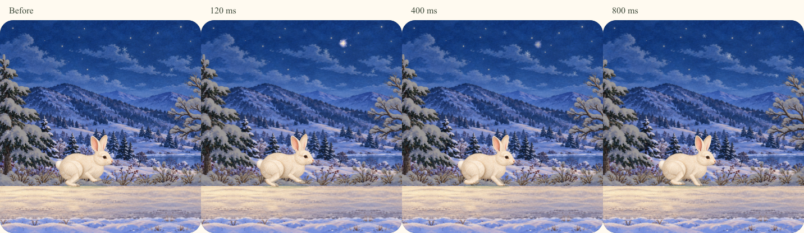

# 원화풍 밤하늘 반짝임

내장 ImageGen으로 현재 겨울 밤 원화의 붓 질감과 남색·아이보리·옅은 보라색을 참고해 작은 빛 하나를 제작했습니다. 원본은 [source.png](source.png), 전체 프롬프트는 [prompt.txt](prompt.txt)입니다. 원본의 실제 투명도를 유지합니다.

배포 파일은 `public/images/scenery-v1/painted-glimmer-v1.webp`이며 `npm run scenery`로 원본의 투명 여백을 정리해 128×128 무손실 WebP로 변환합니다. 사이트에서는 `/timer/images/scenery-v1/painted-glimmer-v1.webp`를 미리 읽어 첫 반짝임이 다운로드를 기다리지 않게 합니다.

실제 표시 크기는 24~36px입니다. 0.8초 안에 빛이 피어나고 부드럽게 잦아들며 완전히 사라집니다. 긴 직선 꼬리·삼각형·벡터 별은 사용하지 않습니다. 최대 22px 옆으로, 5px 아래로만 움직여 작은 빛의 잔상으로 보이게 합니다. 48초 주기마다 조용한 간격을 두고 다음 위치에서 나타납니다.

사계절 밤은 여행의 10초 지점, 로켓 여행은 30초 지점에서 시작합니다. 실제 경과 시간을 사용하며 일시정지·재개·새로고침과 모션 감소를 따릅니다. 브라우저가 잠깐 비활성화되어 반짝임 시간이 지나간 경우, 돌아왔을 때 밀린 이벤트를 재생하지 않습니다.

`tests/paintedScenery.test.ts`는 이미지의 투명 가장자리·반투명 붓 질감·파일 용량을, `tests/seasonalScene.test.ts`는 800ms 수명과 제한된 이동을 확인합니다. Chromium·모바일 WebKit에서는 원화 로드, 반짝임의 소멸, 일시정지·복원과 로켓 UFO의 기존 동작을 확인합니다.
