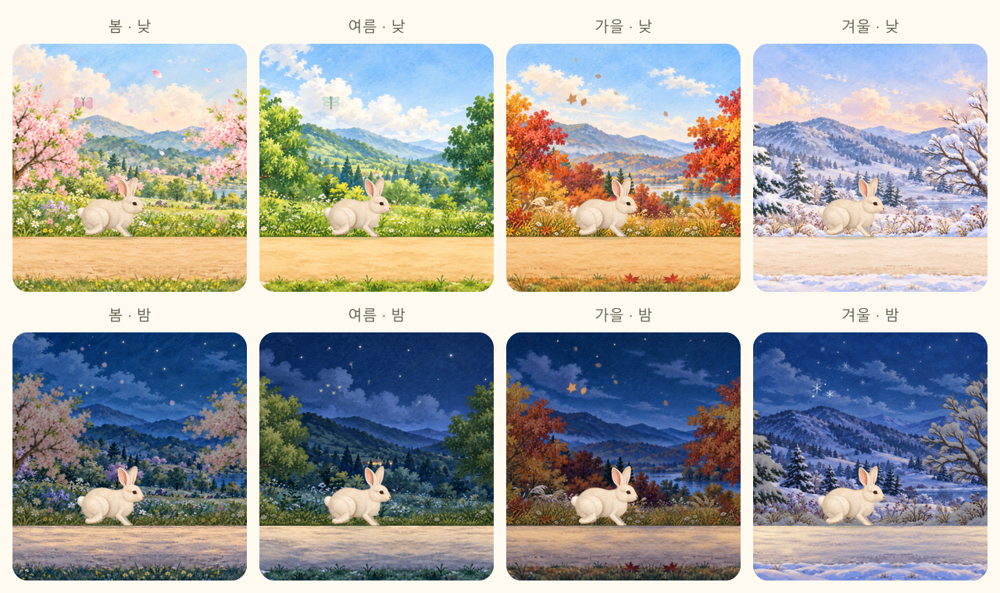

# 원화풍 사계절 배경

기존 [사계절 감성 시안](../seasonal-mood-v1/README.md)을 기준으로 내장 `image_gen.imagegen`을 사용해 낮 풍경 4장, 밤 풍경 4장, 투명한 나무 레이어 4장을 제작했습니다. 최종 프롬프트 전체는 [prompts.json](prompts.json)에 보관합니다. CLI/API 방식은 사용하지 않았습니다.

## 원화와 배포 파일

원본은 이 폴더의 `{spring,summer,autumn,winter}-{day,night,trees}.png` 12개입니다. 낮·밤 원화는 불투명하며, 나무 원화의 투명도를 유지합니다.

실제 사이트는 `public/images/scenery-v1/`의 WebP 20개를 사용합니다. 계절마다 낮 풍경·밤 풍경·낮 길·밤 길·나무로 구성됩니다. [`src/lib/paintedScenery.json`](../../../src/lib/paintedScenery.json)은 파일 경로와 실제 크기를 보관합니다. 모든 요청은 `assetPath()`로 `/timer/images/scenery-v1/`에서 로드합니다.

`npm run scenery`로 원본에서 배포 자산을 다시 만들 수 있습니다. `scripts/prepare-painted-scenery.mjs`는 그림마다 다른 길 높이를 보정하고, 길과 나무를 분리하고, 반사 연결 타일을 무손실 WebP로 저장합니다. 양쪽 반복 경계의 실제 픽셀이 같아 긴 타이머에서도 연결선이 생기지 않습니다. 한 계절의 낮·밤 자산 합계는 4MB 미만이며 다른 계절은 미리 내려받지 않습니다.

## 움직임

먼 풍경은 길 속도의 0.14배, 가까운 나무는 0.55배, 길은 1배로 이동합니다. 원화 비율에 맞춰 화면 높이로 각 레이어의 반복 폭을 계산합니다. 길은 화면 높이의 78%에서 시작하고 기존 발걸음의 실제 이동 거리를 사용합니다. 결승선과 약속 아이콘은 이 레이어들에 포함하지 않습니다.

기존 `useJourneyRenderer`의 프레임 루프가 나무·길·빛·꽃잎·낙엽·눈송이·작은 방문 이벤트를 함께 갱신합니다. 프레임별 React 상태 갱신이나 새 애니메이션 라이브러리를 추가하지 않았습니다. 일시정지·재개·다시 시작·백그라운드 복원은 기존 타임스탬프와 보행 시계를 사용합니다. 시간이 끝나면 배경 이동이 멈추고 기존 결승선 통과와 축하 동작을 진행합니다.

낮·밤은 별도 원화를 1.2초 동안 부드럽게 교차 표시합니다. 대한민국 달력의 사계절과 위치/기기 시간/수동 낮밤 선택을 유지합니다. 모션 감소 환경에서는 배경 스크롤·방문 이벤트·큰 빛 움직임을 줄이고 타이머와 진행 경로를 유지합니다.

부모 메뉴의 **하늘과 배경 → 계절 선택 / 낮 · 밤 선택**에서 8개 배경을 직접 확인합니다. 계절 선택은 `backgroundSeason`에 저장하며 **계절 자동**을 누르면 한국 달력 기준으로 돌아갑니다. 낮에는 봄 제비·여름 백로·가을 기러기 무리·겨울 박새가 날개를 움직이며 지나갑니다. 밤에는 48초마다 2.6초의 짧은 별똥별이 오른쪽 위에서 왼쪽 아래로 지나갑니다. 이벤트도 기존 타이머 시계를 사용해 일시정지·재개·복원과 모션 감소를 따릅니다. 작은 새와 별똥별은 기존 SVG 이벤트 레이어를 확장한 것으로, 원화 파일과 별도의 이미지 다운로드를 추가하지 않습니다.

## 검증

`tests/paintedScenery.test.ts`는 20개 파일의 디코딩, 양쪽 반복 경계, 투명한 나무 하늘, 길 반복 폭, 계절별 용량을 검사합니다. 기존 Chromium·모바일 WebKit 시나리오로 8개 낮밤 조합, 발의 접지, 스크롤 속도, 일시정지·재개·재시작·복원, 결승선 고정과 모션 감소를 확인합니다. 휴대폰·PC·가로 큰 화면의 실제 화면을 캡처해 위 비교 이미지로 보관했습니다.
