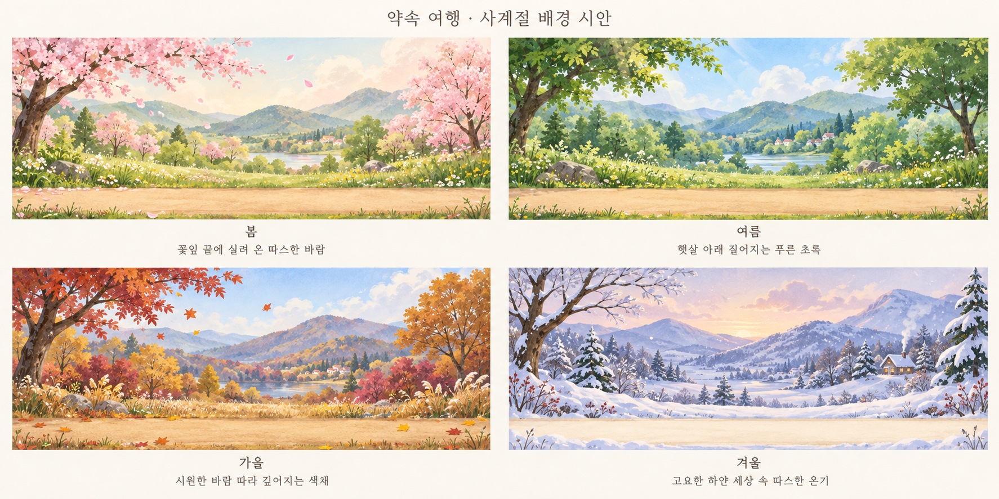

# 사계절 배경 감성 시안

내장 `image_gen.imagegen`으로 새 그림을 생성했습니다. 기존 캐릭터 원화와 어울리는 과슈·수채화 느낌의 배경을 한 장의 2×2 비교 시안으로 구성했습니다.

| 계절 | 감성 | 시각 표현 | 움직임 방향 |
| --- | --- | --- | --- |
| 봄 | 꽃잎 끝에 실려 온 따스한 바람 | 연분홍 벚꽃, 새잎, 복숭앗빛 햇살 | 꽃잎이 느리게 날리고 잔꽃이 살짝 흔들림 |
| 여름 | 햇살 아래 짙어지는 푸른 초록 | 깊은 녹음, 맑은 하늘, 나뭇잎 사이의 빛 | 나뭇잎의 작은 흔들림과 아주 느린 구름 |
| 가을 | 시원한 바람 따라 깊어지는 색채 | 호박색·구릿빛·버건디 단풍, 시원한 하늘 | 드문 낙엽과 가벼운 풀의 흔들림 |
| 겨울 | 고요한 하얀 세상 속 따스한 온기 | 크림빛 눈, 청보라 그림자, 먼 집의 주황 창빛 | 성긴 눈송이와 가느다란 굴뚝 연기 |

캐릭터와 안내 문구를 그려 넣지 않아 배경 자체를 비교할 수 있습니다. 가로로 이어지는 길과 하늘·먼 산·나무·앞쪽 풀의 깊이를 표현했습니다. 실제 구현 때는 반복 가능한 레이어로 따로 제작하고 캐릭터 발 높이·고정 결승선·남은 거리의 가독성을 유지합니다. 현재 파일은 검토용 시안이며 런타임 배경 자산은 교체하지 않았습니다.

원본: [four-seasons-concept.png](four-seasons-concept.png). 최종 생성 프롬프트: [prompt.txt](prompt.txt). 투명 배경을 사용하지 않았습니다.

이 시안을 바탕으로 실제 사이트용 [원화풍 사계절 배경](../painted-v1/README.md)을 제작해 적용했습니다.
