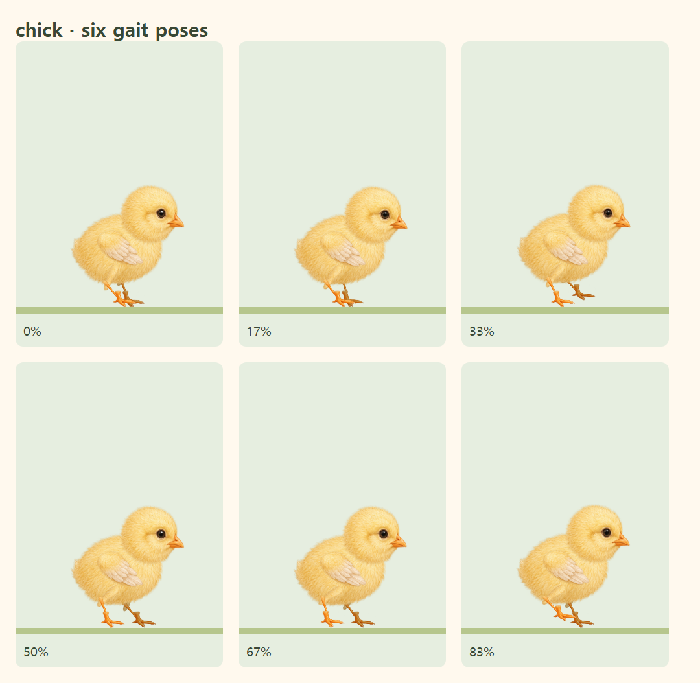
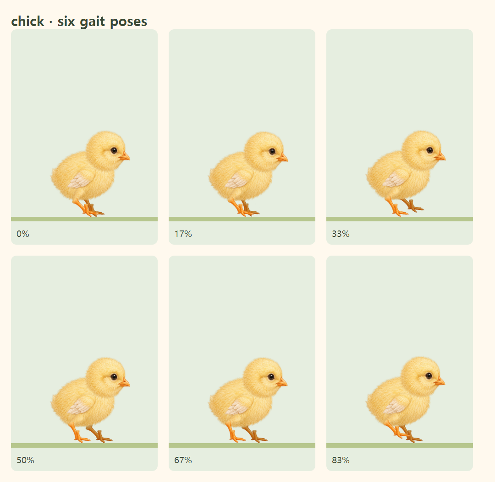

# 병아리 날개 방향·발 접지 교정

기존 ImageGen 원화를 재사용하며 이미지 픽셀은 수정하지 않았습니다.

- 진행 방향으로 향하던 날개 대신, 기존 반대쪽 날개 부위를 사용해 어깨는 앞쪽에, 깃털 끝은 뒤쪽에 둡니다. 실제 원화의 어깨 점을 회전축에 고정합니다.
- 허벅지·정강이·발목을 원화 관절점에 맞춥니다. 발 이미지의 투명 사각형 아래쪽 대신, 실제 발가락 끝을 접지점으로 계산합니다.
- 두 발은 기존대로 교대로 걷고, 지지 중 발의 이동 속도는 지면과 일치합니다.
- 도착 후에는 병아리 몸 전체를 떠오르게 하던 반복 효과를 제거하고, 발을 지면에 둔 채 머리와 날개로 축하합니다. 도착 과정의 점프·착지는 유지합니다.
- 원화와 보행 구조 미리보기의 날개 방향·접지점을 함께 수정합니다.

## 실제 브라우저의 여섯 보행 자세

수정 전:

수정 후:

## 검증

`chickAnatomy.test.ts`는 실제 원화의 관절·날개 부착점과 접지점을 검사합니다. `chick-artwork.spec.ts`는 12개 보행 자세에서 날개 방향과 발가락의 지면 접촉, 지면과 같은 이동 속도, 일시정지·새로고침·재개, 모션 감소, 도착 후 자세를 검사합니다. 실제 SVG를 픽셀로 렌더링해 발 이미지의 투명 여백 때문에 떠 있는 오류도 검출합니다. Chromium과 모바일 WebKit을 사용하며 실제 iPhone 하드웨어 검증을 대신하지 않습니다.
