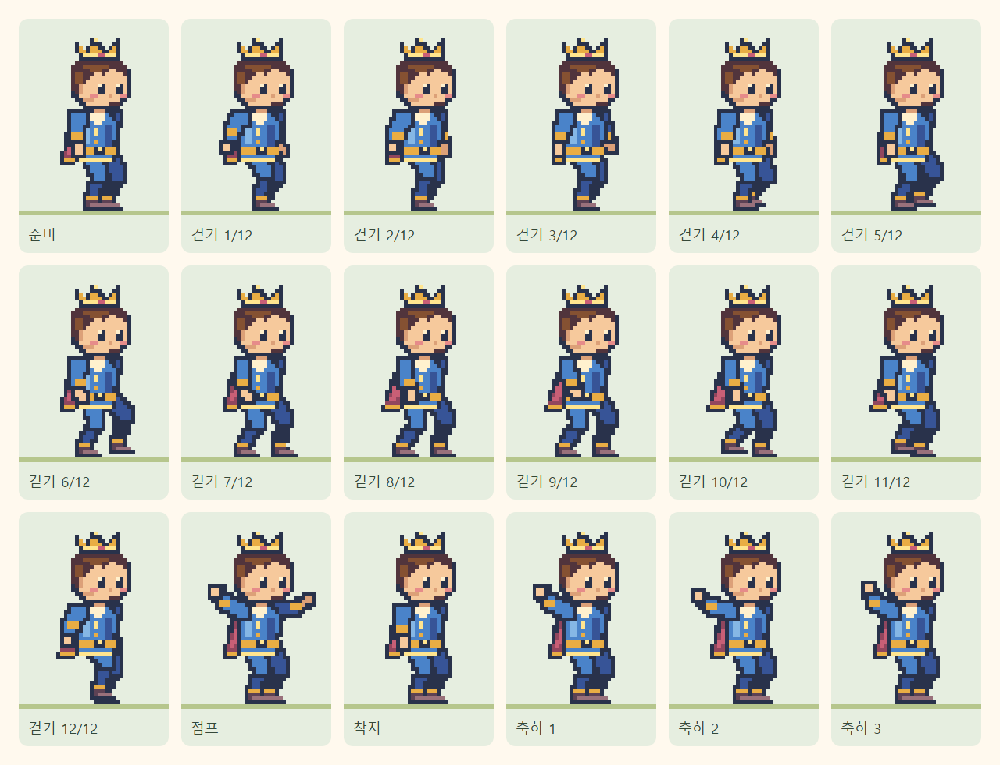

# 8비트 왕자

32×48 픽셀, 16색으로 직접 제작한 오리지널 캐릭터입니다. 금색 왕관, 파란 튜닉, 짧은 붉은 망토와 갈색 부츠를 사용합니다. 기존 동물·공주 원화와 배경은 유지합니다.

도착 시 양팔이 보이도록 교정한 최신 스프라이트와 비교는 [왕자 양팔 축하 자세](../prince-pixel-v2/README.md)를 참고하세요.

[320px 선택 화면](selection-320.png) · [걷기 화면](walking-320.png) · [도착 화면](arrival-320.png)

## 자산과 동작

- `scripts/princeArt.ts`: 정수 픽셀 격자에 전신 프레임을 그립니다. 원화 부위를 따로 회전시키지 않아 어깨·팔꿈치·무릎·목이 분리되지 않습니다.
- `scripts/generate-pixel-prince.ts`: 6열 × 3행 SVG 아틀라스를 생성합니다. `npm run characters`로 재생성할 수 있습니다.
- `public/characters/pixel-v1/prince-celebrate-v2.svg`: 준비 1장, 걷기 12장, 점프 1장, 착지 1장, 축하 3장의 완성된 전신 스프라이트입니다.
- `src/lib/princeMotion.ts`: 1.2초 보행 주기와 프레임 선택을 정의합니다. `PixelPrinceArtwork.tsx`는 `assetPath()`를 적용하여 `/timer/characters/pixel-v1/prince-celebrate-v2.svg`를 표시합니다.
- `useJourneyRenderer.ts`: 기존 타임스탬프 보행 시계로 프레임과 지면 이동을 갱신합니다. 매 프레임 React 상태를 변경하지 않습니다. 평상시 위치를 유지하고 마지막에는 고정 결승점으로 접근해 통과합니다.

발은 교대로 접지하고 팔은 같은 쪽 다리와 반대로 움직입니다. 접지된 발바닥은 기존 지면 좌표 205에 맞춥니다. 픽셀 포즈는 원래 4px 격자에 맞춰 양자화하므로 부드러운 원화 보행과 달리 의도적인 게임 스프라이트 리듬을 갖습니다. 지면은 연속적으로 이동하며, 접지 오차는 네이티브 픽셀 하나 이내로 검사합니다.

일시정지·새로고침은 같은 보행 프레임을 복원합니다. 도착 시 `CROSS_FINISH → BRAKE → SETTLE → JUMP → LAND → CELEBRATE`를 사용하며, 축하에서는 양팔을 들고 손을 흔듭니다. 모션 감소에서는 준비 프레임으로 고정하고 배경 스크롤을 제거합니다. 추가 런타임 라이브러리는 없습니다.

## 검증

`tests/princeMotion.test.ts`는 18개 프레임의 전신 연결, 접지, 보행 속도, 픽셀 격자, 모션 감소와 타임스탬프 기반 반복을 검사합니다. `tests/e2e/prince-artwork.spec.ts`는 실제 SVG를 픽셀로 디코딩하여 빈 그림·분리된 팔다리·지면 높이를 확인하고, 320px 선택·재선택·보행·일시정지·재개·새로고침·도착·효과음 1회·별 보상을 검사합니다. 전체 친구 검사에도 왕자를 포함합니다.

Chromium과 모바일 WebKit으로 검증합니다. 실제 iPhone 하드웨어의 소리·잠금 정책 검증을 대체하지는 않습니다.

2026-10-09: 타입 검사·린트·정적 빌드·`/timer/` 자산 검사와 단위 검사 51개 통과. 왕자·공주·전체 친구 관련 브라우저 검사 14개 통과 후, 선택·진행 아이콘의 스프라이트 잘림을 고친 최종 빌드에서 관련 4개를 재검사했습니다.
