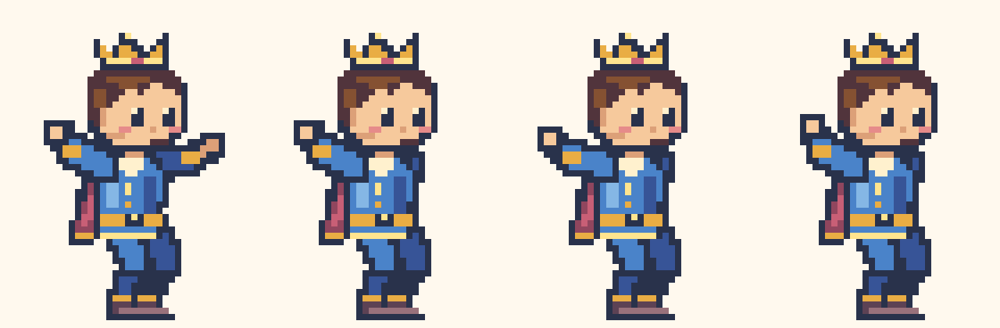
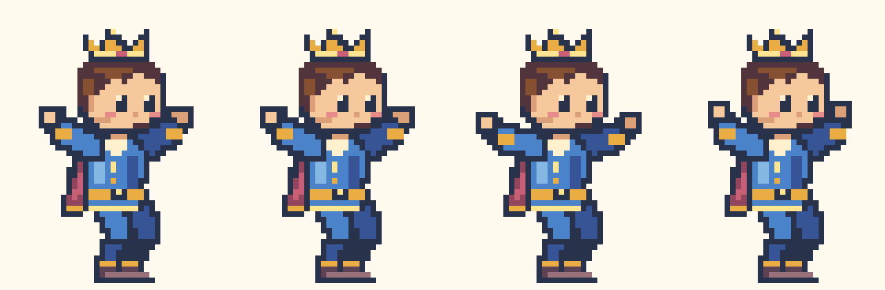

# 왕자 양팔 축하 자세

축하 3프레임에서 가까운 팔만 들고 반대쪽 팔은 몸통 뒤에 숨던 문제를 교정했습니다. 양팔의 회전 방향을 반대로 적용하고, 뒤쪽 어깨를 바깥으로 한 픽셀 열어 손과 소매가 얼굴 바깥에 보이도록 했습니다. 점프 프레임에도 같은 양팔 자세를 적용합니다. 기존 32×48 격자·16색·보행 12프레임과 도착 순서를 유지합니다.

수정 전: 점프와 축하 세 자세

수정 후: 점프와 축하 세 자세

`scripts/princeArt.ts`로 원본 픽셀을 생성하고 `scripts/generate-pixel-prince.ts`로 `public/characters/pixel-v1/prince-celebrate-v2.svg`를 만듭니다. 버전이 다른 파일명을 사용해 이전 스프라이트의 브라우저 캐시를 피합니다. 선택 화면·작은 진행 아이콘·실제 타이머가 같은 자산을 사용합니다.

`tests/princeMotion.test.ts`는 점프 및 축하 세 프레임의 손이 얼굴 양쪽에 실제로 칠해져 있는지, 팔다리가 연결되어 있는지 검사합니다. `tests/e2e/prince-artwork.spec.ts`는 Chromium과 모바일 WebKit에서 실제 SVG를 디코딩해 축하 세 프레임의 두 손 픽셀과 연결을 확인하고 보행·일시정지·새로고침·모션 감소·완료음 한 번·별 보상을 검사합니다.
