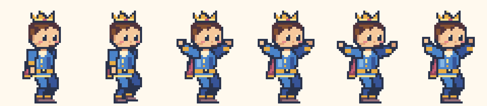
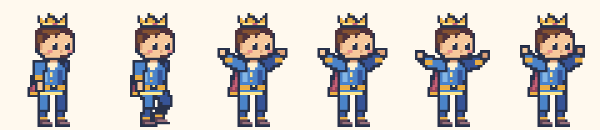

# 왕자 곧게 서는 자세

서 있는 프레임에도 보행용 역기구학을 적용해 무릎이 앞으로 접혀 있었습니다. 준비·점프·착지·만세 프레임은 골반 아래로 무릎과 발목을 수직 정렬하고, 두 다리와 부츠 사이에 간격을 뒀습니다. 걷기 프레임은 허벅지·종아리 길이를 줄여 지지하는 무릎이 과하게 굽혀지지 않게 했습니다. 기존 발 궤적·지면 높이·양팔 만세·16색 스타일은 유지합니다.

왼쪽부터 준비, 걷기 5번, 점프, 축하 세 프레임입니다.

수정 전:

수정 후:

선택 카드·진행 아이콘·실제 타이머는 모두 `/timer/characters/pixel-v1/prince-upright-v3.svg`를 사용합니다. 파일명을 바꿔 이전 캐시가 남지 않게 했습니다. 단위 검사는 곧은 다리·분리된 부츠·발바닥 높이와 보행 접지를, 브라우저 검사는 실제 SVG 픽셀·양손·선택·걷기·일시정지·복원·도착을 확인합니다.
