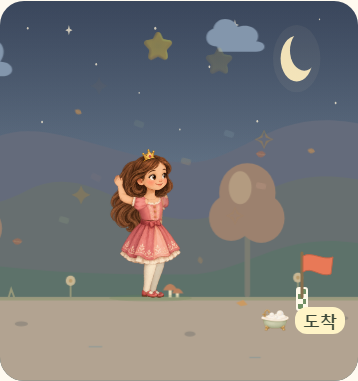
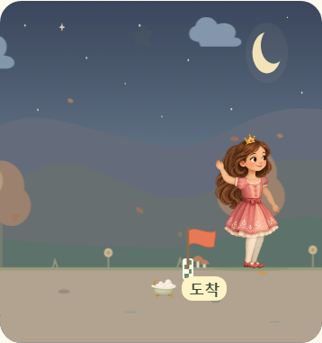

# 공주 팔 가림과 결승선 통과 교정

기존 원화 두 장을 그대로 재사용합니다. 도착 시 뒤쪽 팔의 각도가 드레스 안쪽을 향해 팔과 손이 가려졌으므로, 준비·착지·축하 자세에서 오른쪽 실루엣 밖으로 보이도록 어깨·팔꿈치 각도를 조정했습니다. 가까운 팔은 기존 손 흔들기를 유지합니다.

| 수정 전 | 수정 후 |
| --- | --- |
|  |  |

결승점은 화면 크기에 맞춰 한 번 배치하고 배경과 함께 움직이지 않습니다. 오른쪽에 캐릭터 전체가 설 공간을 확보합니다. 평상시에는 42% 위치에서 걷고 마지막 몇 초에 접근합니다. 정확히 0초에 선에 도달한 뒤 통과·감속·자세 안정화·점프·착지·축하를 차례로 수행합니다.

`arrivalMotion.ts`가 실제 경과 시간과 캐릭터별 보행 속도로 접근·통과 거리를 계산합니다. 접근 시에는 보행 거리를 캐릭터 전진과 배경 이동으로 나누고, 통과 중에는 멈춘 지면 위에서 실제 전진 거리에 맞춰 관절 주기를 진행합니다. 단일 진행률 이동이나 별도의 프레임 누적 타이머는 사용하지 않습니다.

`tests/arrivalMotion.test.ts`는 선을 일찍 넘지 않는지, 접지 속도의 합이 맞는지, 감속 후 속도가 0인지 검사합니다. `tests/e2e/finish-crossing.spec.ts`는 고정 도착점, 통과 후 축하, 완료음 한 번, 320px·세로·가로·PC·새로고침 복원을 검사합니다. 실제 SVG를 픽셀로 렌더링한 뒤 각 팔의 아래쪽 부위를 제거한 이미지와 비교해, 두 팔이 드레스 뒤에 숨지 않고 화면에 보이는지도 검사합니다.
