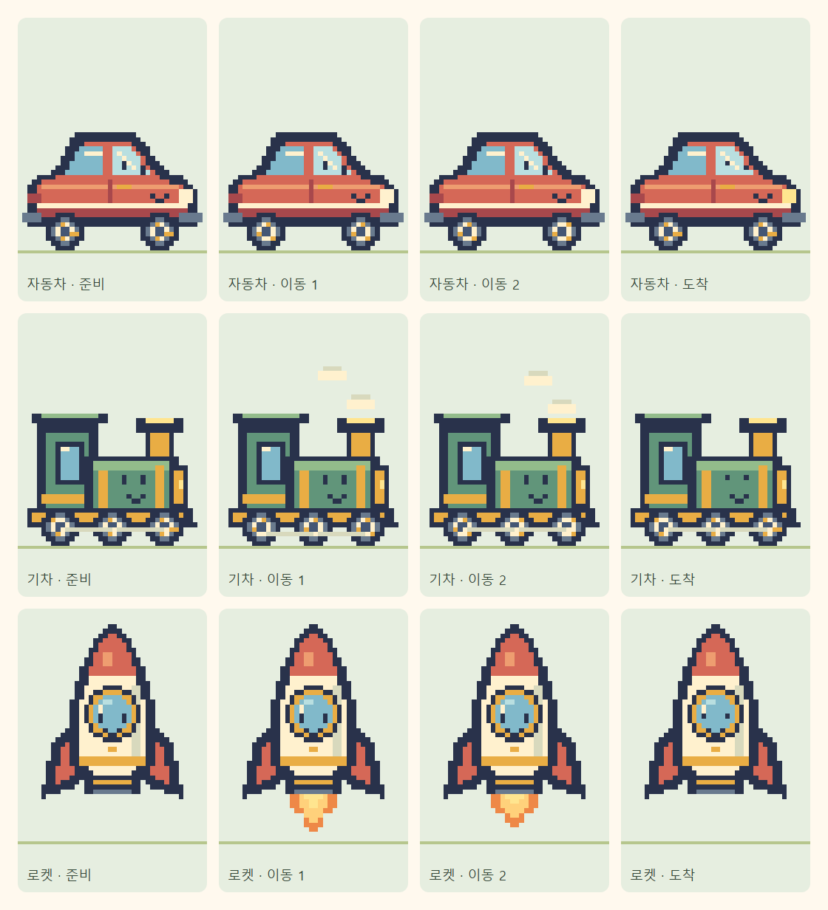

# 자동차·기차·로켓 픽셀 아트

왕자와 어울리는 어두운 윤곽선과 따뜻한 16색을 사용하는 오리지널 8비트 스타일입니다. 각 캐릭터를 40×48 정수 픽셀로 그려 4배 크기의 SVG 프레임에 담습니다.

[320px 선택 화면](selection-320.png) · [자동차](car-walking-320.png) · [기차](train-walking-320.png) · [로켓](rocket-walking-320.png) · [도착 화면](train-arrival-320.png)

- **자동차:** 기존 빨간색 계열의 소형차, 밝은 창문과 웃는 얼굴, 두 바퀴 회전.
- **기차:** 초록·금색 기관차, 오른쪽을 향한 굴뚝, 세 바퀴·연결봉과 작은 증기.
- **로켓:** 크림·주황색의 수직 우주선. 머리·몸통·창문·양쪽 날개·분사구·불꽃을 하나의 중심축에 맞췄습니다.

## 구현

`scripts/pixelArt.ts`는 픽셀 격자 도구이고, `scripts/vehicleArt.ts`가 그림을 정의합니다. `scripts/generate-pixel-vehicles.ts`를 실행하거나 `npm run characters`를 사용하면 `public/characters/pixel-v1/`에 `car.svg`, `train.svg`, `rocket-upright-v2.svg`를 생성합니다. 캐릭터마다 준비 1장·이동 8장·점프 1장·착지 1장·축하 3장으로 총 14장의 전신 프레임을 보관합니다. 로켓은 새 파일명으로 이전 대각선 그림의 브라우저 캐시를 갱신하며, 기존 `rocket.svg`는 이전 앱 버전의 요청을 위해 유지합니다.

`PixelVehicleArtwork.tsx`를 선택 카드, 작은 진행 아이콘과 여행 화면에서 함께 사용합니다. 모든 표시 영역은 한 프레임만 보여주도록 잘라내며, 자산 주소는 `assetPath()`로 `/timer/`를 적용합니다. 실제 그림은 SVG의 정수 사각 경로로 구성하여 회전·보간으로 픽셀 가장자리가 흐려지지 않습니다.

`pixelVehicles.ts`는 프레임 선택을 담당합니다. 기존 900ms·1000ms·1200ms의 캐릭터 주기와 타이머·지면 이동 속도를 유지합니다. 자동차·기차의 바퀴는 기존 반지름 16의 둘레와 누적 지면 거리를 기준으로 시계 방향으로 회전합니다. 로켓 불꽃은 같은 이동 시계의 비행 주기에 맞춥니다.

`useJourneyRenderer.ts`는 기존 requestAnimationFrame 루프에서 프레임이 바뀔 때만 뷰포트를 갱신합니다. React 상태를 매 프레임 갱신하지 않습니다. 일시정지·새로고침·재개에서 동일한 시계로 자세를 복원하며, 종료에는 기존 안정화·점프·착지·축하 순서를 사용합니다. 모션 감소에서는 준비 프레임으로 고정하고 배경 스크롤을 제거합니다. 기존 캐릭터 ID와 저장된 여행도 유지합니다.

완료 후에는 작은 표정·헤드라이트 변화로 축하합니다. 계속 기울이던 공통 축하 회전은 차량에서 제거하여 픽셀 윤곽과 바퀴의 지면 위치를 유지합니다.

## 검증

`tests/pixelVehicles.test.ts`에서 기존 주기·접지 높이·바퀴 둘레와 지면 이동·모션 감소·42개 프레임의 실제 SVG 픽셀 격자를 검사합니다. 로켓 14개 프레임은 모든 행의 실루엣과 불꽃이 수직 중심선에 좌우 대칭인지 추가 검사합니다. `tests/e2e/pixel-vehicles.spec.ts`에서 세 캐릭터의 반복 선택·자산 로딩·한 프레임 잘림·이동·일시정지·새로고침·재개·50%·90%·도착·소리 1회·별 보상·320px과 가로 화면을 검사합니다.

PC Chromium과 모바일 WebKit을 사용하며, 실제 iPhone 하드웨어의 소리·잠금 정책 검증을 대체하지는 않습니다.

2026-10-09: 타입 검사·린트·정적 빌드·`/timer/` 자산 검사와 단위 검사 55개 통과. 기존 친구·왕자 관련 브라우저 검사 12개와 차량 검사 6개 통과. 최종 축하 회전을 제거한 빌드에서도 차량 검사 6개를 다시 확인했습니다.

2026-10-09 로켓 수직 정렬 수정: 타입 검사·린트·정적 빌드·단위 검사 56개와 로켓 브라우저 검사 2개(Chromium·모바일 WebKit) 통과. 선택 카드와 320px 이동 화면·프레임 시안을 갱신했습니다.
