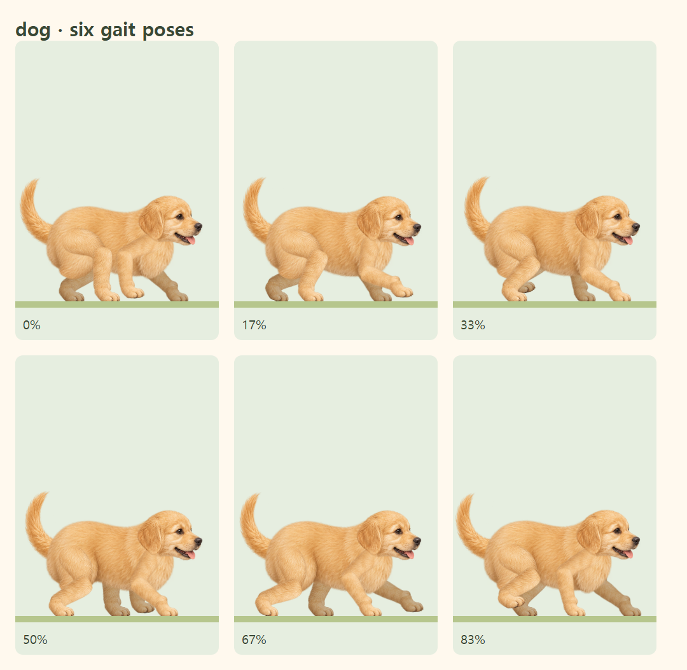
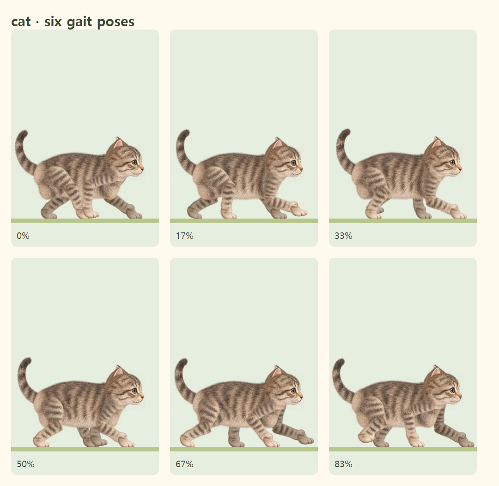

# 강아지·고양이 원화 관절 보행

기존 ImageGen 부위 그림을 토끼와 같은 관절점 기반 렌더러에 연결했습니다. 그림을 새로 그리거나 픽셀을 수정하지 않았습니다.

- 원본 종횡비를 유지하고 엉덩이·어깨 뿌리를 몸통 안에 배치합니다.
- 그림 속 무릎·발목이 실제 회전축과 일치하도록 부위를 균등 확대·회전합니다.
- 뒤꿈치 들기 → 발 접기 → 착지를 연결하며 발끝의 지면 접촉점을 IK로 보정합니다.
- 강아지·고양이의 네 발 순차 보행과 고양이의 앞·뒷발 자국 연결은 유지합니다.
- 가까운 다리 뿌리는 몸통의 털에 부드럽게 겹치고, 먼 다리는 몸통 뒤에 배치합니다.
- 곰은 현재 목록과 미리보기에서 제거했습니다. 이전 저장된 여행은 토끼로 이어집니다.

## 실제 브라우저 렌더링

한 보행 주기의 여섯 자세를 기존 SVG 렌더러로 캡처했습니다.

## 자동 검증

`walkingAnimals.test.ts`, `walking-animals.spec.ts`는 원화 비율, 몸통·귀의 부착점, 관절 위치와 발끝 접지, 반복 경계의 연속성, 12개 보행 자세에서 네 발의 실제 픽셀 연결, 일시정지·새로고침·재개, 이전 곰 세션 복원을 검사합니다. 기존 토끼 관절·귀 검사도 유지합니다. Chromium과 iPhone 크기의 WebKit을 사용하며 실제 iPhone 하드웨어 검증을 대신하지 않습니다.
