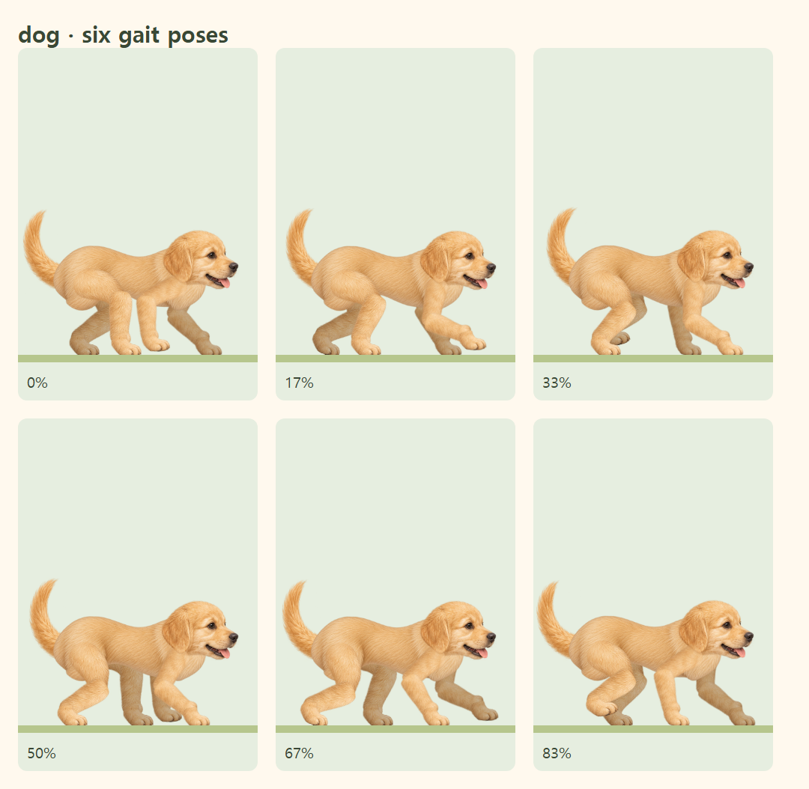
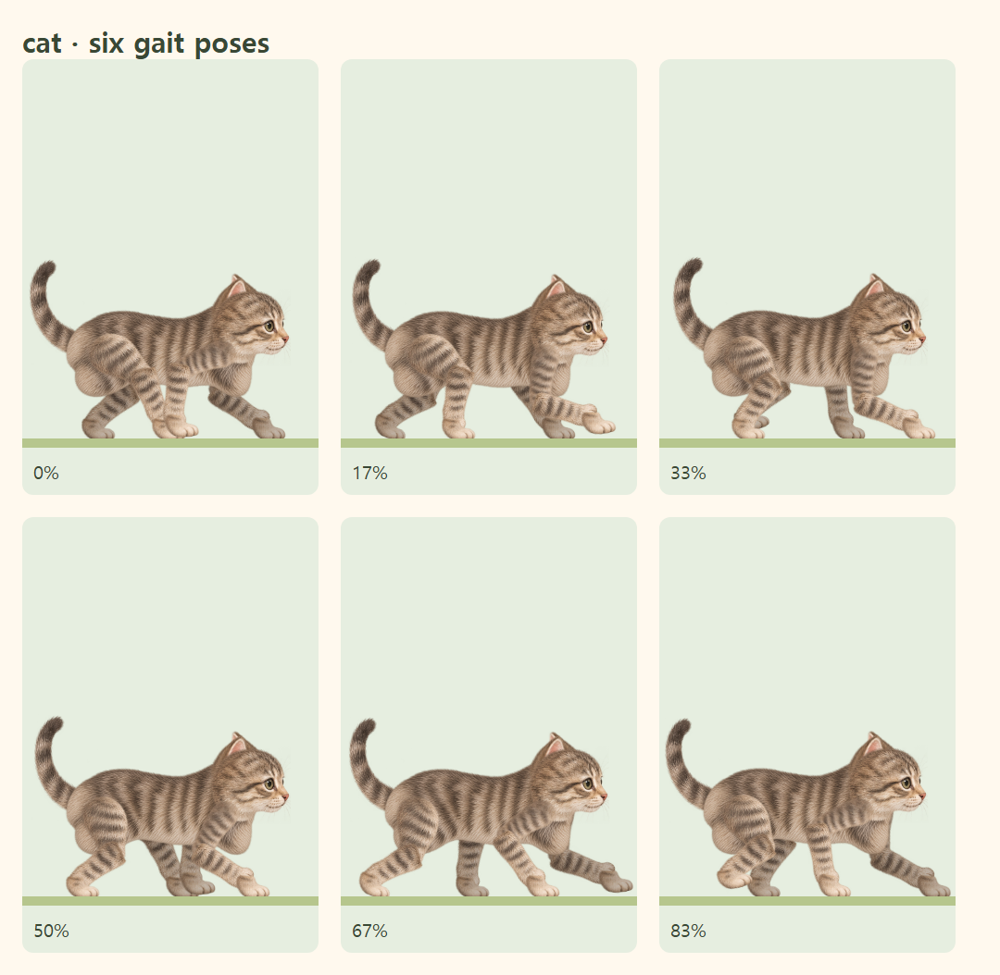

# 강아지·고양이 몸통 곡선 개선

각진 몸통 부위만 내장 ImageGen 도구의 이미지 편집 모드로 다시 그렸습니다. 기존 털 색과 줄무늬, 머리·귀·꼬리·네 다리 원화를 유지하고, 등·엉덩이·가슴을 둥글게 만들며 배를 살짝 들어간 곡선으로 표현했습니다. 두 원화 모두 투명 배경입니다.

## 저장 자산과 적용

| 친구 | ImageGen 원본 | 사이트 자산 |
| --- | --- | --- |
| 강아지 | [dog-torso.png](dog-torso.png) | [dog-torso-v7.webp](../../../public/characters/raster-v1/dog-torso-v7.webp) |
| 고양이 | [cat-torso.png](cat-torso.png) | [cat-torso-v7.webp](../../../public/characters/raster-v1/cat-torso-v7.webp) |

`scripts/prepare-walking-torsos.mjs`는 원본을 비율 유지·최대 640px 폭의 무손실 WebP로 저장하고, 투명 여백을 제외한 SVG viewBox를 `src/lib/walkingTorsoArt.json`에 기록합니다. 프로그램으로 몸통 윤곽을 다시 그리거나 픽셀을 지우지 않았습니다.

`PaintedAnimalArtwork.tsx`의 몸통 부위만 새 자산을 사용합니다. `walkingAnatomy.ts`에서 새 원화 비율을 유지하며 고양이의 몸통 폭을 103에서 107로 조정해 앞다리 뿌리를 덮었습니다. 기존 관절 좌표·보행·발 접지와 머리·귀·꼬리는 그대로 사용합니다. 메인 캐릭터와 진행바의 작은 캐릭터가 같은 렌더러를 사용하므로 두 곳에 함께 반영됩니다. 선택 카드의 기존 전신 그림은 유지합니다.

공개 자산 주소는 `/timer/characters/raster-v1/dog-torso-v7.webp`와 `/timer/characters/raster-v1/cat-torso-v7.webp`이며 공통 `assetPath()`로 로드합니다.

## 실제 조립 결과

한 보행 주기의 여섯 자세를 실제 브라우저에서 캡처했습니다.





## 최종 ImageGen 프롬프트

내장 도구 모드: `image_gen.imagegen`, 기존 몸통 부위 참조 편집, `transparent_background: true`. 참조는 기존 `public/characters/raster-v1/dog.webp`와 `cat.webp`에서 `animalAtlases.json`의 몸통 영역을 추출해 검사한 이미지입니다. 강아지는 첫 결과보다 윤곽 변화가 더 분명한 두 번째 결과를 채택했습니다.

### 강아지

```text
Use case: precise-object-edit. Redesign this isolated golden puppy torso into a MORE SLENDER and rounded natural puppy body, as a transparent articulated character component. Keep the exact pale golden painted fur color and soft realistic fur detail. Change the silhouette substantially: gently arched continuous back with NO pointed neck spike; softly rounded rump on the left; smooth round chest on the right with NO flat vertical wall; a clearly tucked-up curved belly, slender in its middle, with a gradual organic curve connecting hip and shoulder. Reduce the very deep lower bulges: those should be subtle hip and chest volumes, not baked-in thighs or legs. This is one smooth continuous furry ribcage/abdomen, NOT a rectangular block, NOT two giant attached leg masses, NOT a geometric oval. Right-facing side-view, roughly 1.9:1 body width to height. Keep fully opaque attachment areas around 20% and 89% across the width, halfway down the torso. No head, face, ears, neck stump, tail, limbs or paws. No floor, shadows, captions or extra components. Genuine transparent alpha with no colored halo or haze. One large detached torso centered with clear margins. The changed back, chest and belly outline must be visibly more curved and lighter than the source.
```

### 고양이

```text
Use case: precise-object-edit. Asset type: torso-only replacement for an articulated tabby kitten in a children's visual timer. Reference image is the existing torso: preserve the soft realistic painted brown-gray tabby fur and dark stripe identity, but significantly CHANGE the outline because the current one looks like a rectangular fur block. Produce a lean, rounded, naturally curved kitten torso in a pure right-facing side view: rounded hindquarters on the left, slender waist, gently curved back, softly rounded shoulder and chest on the right, visibly tucked-up belly between hip and chest. The belly must be a smooth shallow arch, not a straight horizontal base; the right chest must curve inward organically, not form a vertical wall. No squared corners, no flat lower contour, no geometric capsule. One continuous opaque torso component with no holes, with broad enough hip/shoulder attachment areas at about 20% and 88% across its width and halfway down. Approximate width:height ratio 1.9:1. Detached body ONLY: no head, ears, neck spike, tail, paws or legs, no ground or shadow, no lettering or extra parts. Keep soft individual furry edges, warm gray-brown painted fur matching reference, genuine fully transparent alpha outside the body, no brown haze or colored halo. Large single torso centered with clear margins.
```

## 검증

- 타입 검사·린트·정적 빌드·`/timer/` 자산 검사 통과.
- 단위 검사 87개 통과. 몸통 종횡비, 실제 불투명 영역 안의 네 다리 뿌리, 투명 모서리와 들어간 배 곡선을 검사합니다.
- Chromium·모바일 WebKit 검사 12개 통과. 두 동물 각각 12개 보행 자세의 실제 픽셀 연결, 관절 정합, 발끝 접지, 320px 화면, 일시정지·재개·새로고침, 진행바와 메인 자세 동기화, 모션 감소와 도착 후 정지를 검사합니다.

모바일 WebKit 검사는 실제 iPhone 하드웨어 검증을 대체하지 않습니다.
